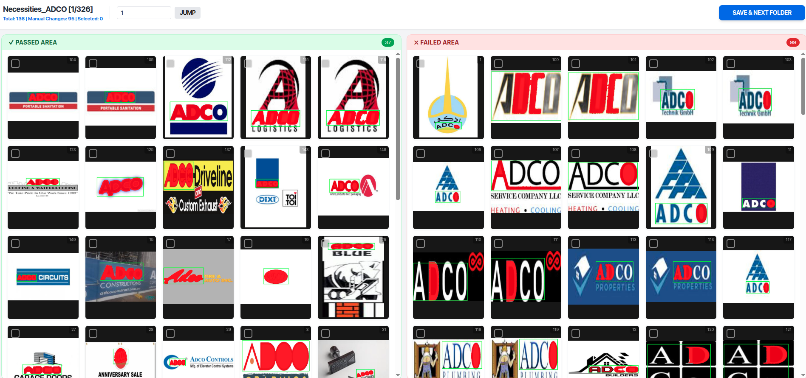

# AutoMask Refinery


Automate and refine image segmentation masks instantly with YOLO and an intuitive web interface. Tailored for computer vision researchers and data annotators, AutoMask Refinery speeds up dataset preparation by up to 10x by combining zero-shot AI predictions with responsive human-in-the-loop correction tools.



## ✨ Key Features

- **Segment complex images accurately** using state-of-the-art Ultralytics YOLO models integrated natively.
- **Refine generated masks intuitively** via a responsive Flask web interface equipped with brush and eraser tools.
- **Process thousands of images in batch mode** effortlessly with PyTorch GPU acceleration.
- **Export clean, high-quality masks** automatically in formats compatible with major ML frameworks (e.g., COCO, Pascal VOC).
- **Organize datasets intelligently** using the built-in `organize_files.py` utility to split data into train, test, and validation sets.
- **Review annotation progress seamlessly** with the automatically updated `review_details.csv` tracker.

## 🚀 Quick Start

Get the AutoMask Refinery web interface running locally in under 3 minutes.

```bash
# 1. Clone the repository
git clone https://github.com/quangkmhd/AutoMask-Refinery.git
cd AutoMask-Refinery

# 2. Install dependencies
pip install -r requirements.txt

# 3. Start the Flask application
python src/app.py

# 4. Open your browser
# Navigate to http://localhost:5000
```

**Expected Output:** A web interface will load, allowing you to upload an image. The AI will instantly generate an initial mask overlay that you can click and drag to refine.

## 📦 Installation

We support both local Python installations and containerized environments.

### Method 1: Local Python Environment

Ideal for developers who want to modify the source code.

```bash
python -m venv venv
source venv/bin/activate
pip install --upgrade pip
pip install -r requirements.txt
```

### Method 2: Docker Container (Recommended)

Ensures zero dependency conflicts, especially for OpenCV and system libraries.

```bash
# Build the Docker image
docker build -t automask-refinery .

# Run the container
docker run -p 5000:5000 -v $(pwd)/data:/app/data automask-refinery
```

## 💻 Usage Examples

### Example 1: Interactive Mask Refinement (Web UI)

**Problem:** You have an image where the automatic YOLO mask slightly missed the edge of the object.

1. Navigate to `http://localhost:5000`.
2. Click **Upload Image** and select your file.
3. The UI will display the YOLO prediction as a semi-transparent blue overlay.
4. Select the **Brush** tool (shortcut: `B`) to paint over missed areas, or the **Eraser** tool (shortcut: `E`) to remove false positives.
5. Click **Save Mask**. The corrected mask is saved to `/data/masks/`.

*Concept: AutoMask Refinery treats the AI prediction as a starting point. The Flask backend coordinates with frontend Canvas API to capture human corrections.*

### Example 2: Batch Processing Images

**Problem:** You have 5,000 raw images in a folder and need baseline masks generated for all of them overnight.

```python
# src/batch_segment.py (Conceptual usage)
from model.yolo_segmenter import YOLOSegmenter
from tqdm import tqdm
import os

segmenter = YOLOSegmenter(weights="yolov8n-seg.pt")
input_dir = "./data/raw_images"
output_dir = "./data/auto_masks"

os.makedirs(output_dir, exist_ok=True)

for filename in tqdm(os.listdir(input_dir)):
    if filename.endswith(".jpg"):
        img_path = os.path.join(input_dir, filename)
        mask = segmenter.predict_mask(img_path)
        segmenter.save_mask(mask, os.path.join(output_dir, filename))
```
**Expected Output:** A progress bar detailing the segmentation speed (e.g., `100%|██████████| 5000/5000 [15:20<00:00, 5.43it/s]`).
*Concept: The backend leverages PyTorch's batching capabilities to process large datasets without human intervention.*

### Example 3: Dataset Organization

**Problem:** After refining masks, you need to split the data into training and validation sets for a downstream model.

```bash
# Run the built-in utility script
python organize_files.py --input_images ./data/images --input_masks ./data/masks --output_dir ./data/dataset --split 0.8
```
**Expected Output:**
```text
Found 1000 matched image-mask pairs.
Creating train split (800 files) -> ./data/dataset/train
Creating val split (200 files) -> ./data/dataset/val
Organization complete!
```
*Concept: Data preparation doesn't end at drawing masks. The `organize_files.py` script ensures your data is instantly ready for PyTorch Dataloaders.*

## 🔧 Troubleshooting

- **OpenCV Error: `libGL.so.1: cannot open shared object file`**
  - *Cause:* Missing system libraries for OpenCV GUI functions on Linux.
  - *Solution:* Run `sudo apt-get install libgl1-mesa-glx` or install `opencv-python-headless` instead of `opencv-python`.
- **YOLO Weights not downloading:**
  - *Cause:* Network restrictions or proxy issues blocking Ultralytics from fetching the `.pt` file.
  - *Solution:* Manually download `yolov8n-seg.pt` from the Ultralytics GitHub and place it in the project root.
- **Flask App Freezes on Large Images:**
  - *Cause:* High memory consumption when converting 4K images to Base64 for the frontend.
  - *Solution:* Ensure `MAX_IMAGE_SIZE` is set in your `.env` to resize images before serving them to the UI.

## 📚 Documentation Links

- **[Customizing YOLO Models](./docs/CUSTOM_YOLO.md)**  
  Elevate your segmentation accuracy by swapping out or fine-tuning the underlying YOLO architectures. This guide uncovers the precise model loading mechanisms, weight configurations, and hardware acceleration techniques necessary to turbocharge your AI predictions.

- **[Frontend Canvas Integration Guide](./docs/FRONTEND.md)**  
  Peek behind the curtain of our highly responsive human-in-the-loop web interface. Understand how the Flask backend communicates seamlessly with the HTML5 Canvas API, managing Base64 image conversions and real-time brush/eraser events for flawless mask corrections.

- **[Export Formats (COCO, VOC)](./docs/EXPORT_FORMATS.md)**  
  Ensure your meticulously refined datasets are perfectly formatted for your downstream training pipelines. This crucial document breaks down the exact JSON and XML structures generated by the application, ensuring seamless integration with standard computer vision frameworks.

## 🤝 Contributing

We love pull requests from everyone. By participating in this project, you agree to abide by the thought-out code of conduct.

1. Fork the repo.
2. Create a branch (`git checkout -b fix-mask-bug`).
3. Commit your changes (`git commit -am 'Fix bug where eraser tool fails on edges'`).
4. Push to the branch (`git push origin fix-mask-bug`).
5. Create a new Pull Request.

## 📄 License

This project is licensed under the MIT License - see the `LICENSE` file for details.

## 🙏 Credits

- Powered by [Ultralytics YOLO](https://github.com/ultralytics/ultralytics).
- Web framework provided by [Flask](https://flask.palletsprojects.com/).
